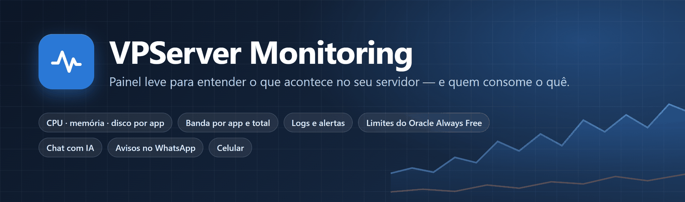
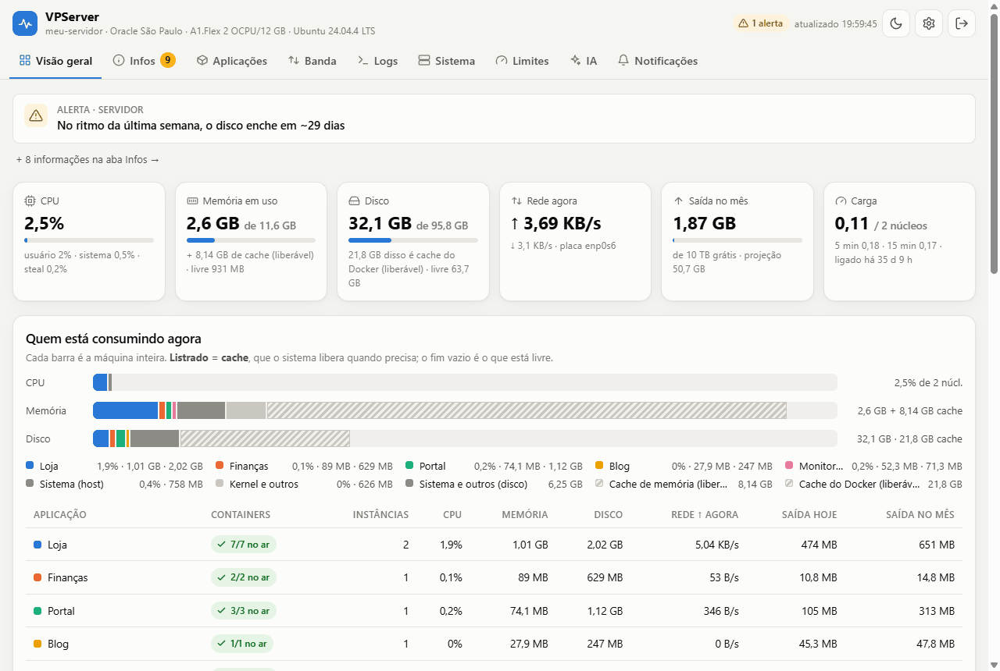
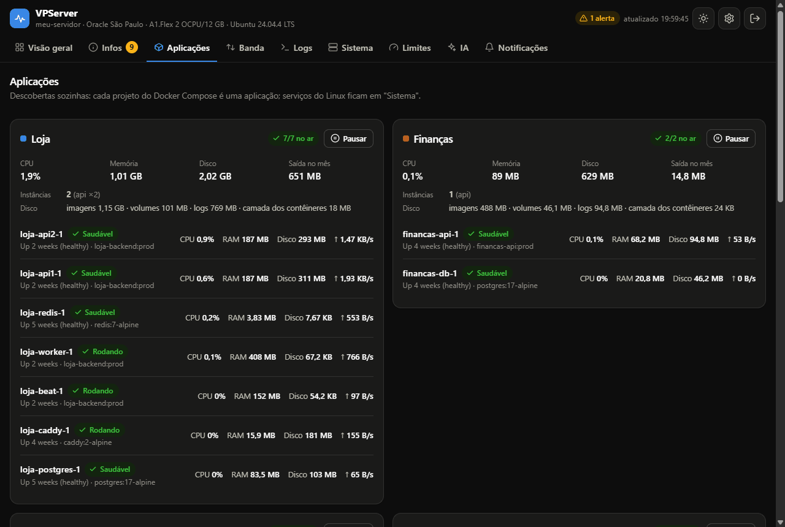
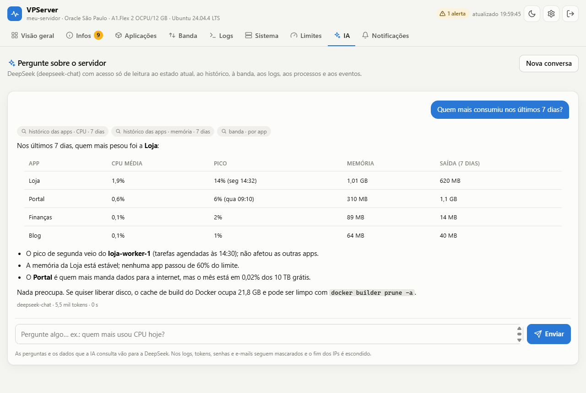
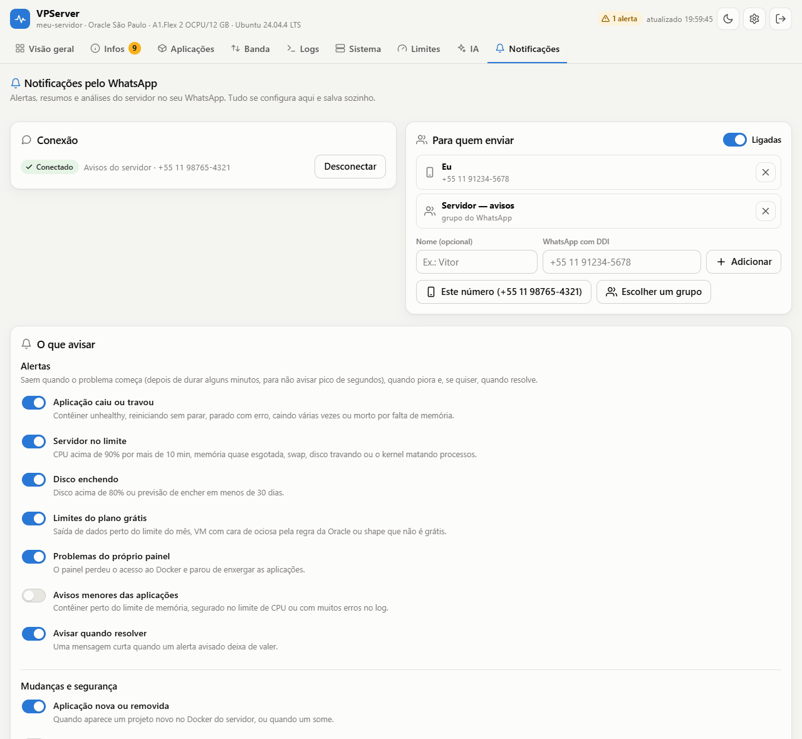
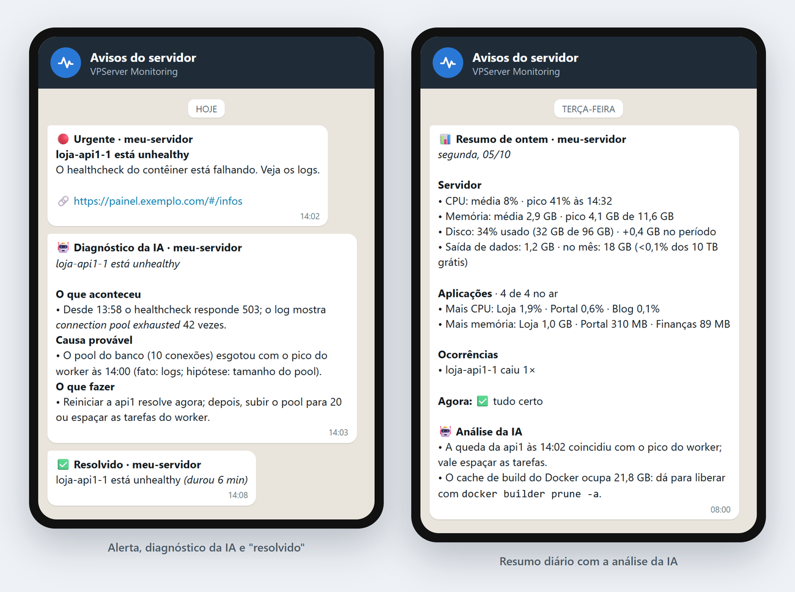
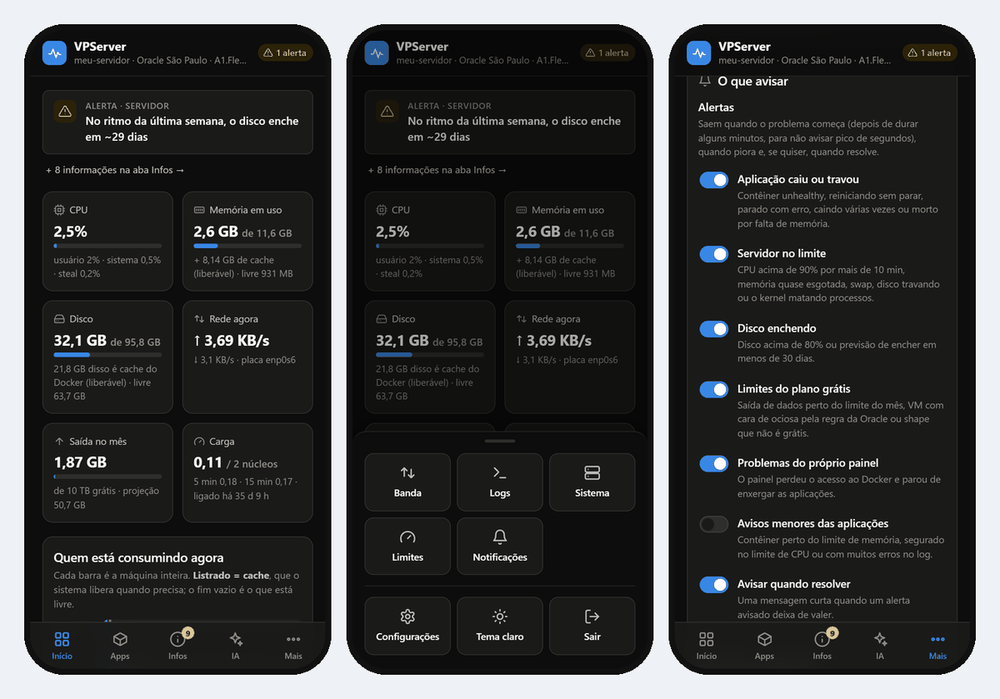

<p align="center"></p>

# VPServer Monitoring

Painel web leve para **entender o que está acontecendo num servidor** e quem está
consumindo o quê: CPU, memória, disco (com o que é cache), rede, banda enviada (por
app e no total), logs dos contêineres, processos, eventos, alertas e os **limites do
plano grátis da Oracle Cloud** — com um **chat de IA** (DeepSeek) para perguntar sobre
tudo isso, **avisos e resumos pelo WhatsApp** e um botão para **pausar e retomar** uma
aplicação.

Feito para uma **VM da Oracle Cloud (Always Free)** com apps em Docker, mas funciona em
qualquer Linux com Docker e cgroup v2. Leve: o painel em si são 4 contêineres, ~45 MB de
RAM e ~0,1% de CPU (o WhatsApp, opcional, soma ~250 MB). Feito para o celular também
(menu embaixo, ao alcance do polegar), tem tema claro e escuro e **descobre sozinho** as
aplicações (cada projeto do Docker Compose vira uma app).

<p align="center"></p>

<table>
<tr>
<td width="50%"><br><sub><b>Aplicações</b> (tema escuro): cada contêiner, consumo, disco e o botão Pausar</sub></td>
<td width="50%"><br><sub><b>IA</b>: pergunte em português; ela consulta o histórico e responde com números</sub></td>
</tr>
<tr>
<td width="50%"><br><sub><b>Notificações</b>: WhatsApp por QR code, destinos e cada tipo de aviso</sub></td>
<td width="50%"><br><sub><b>Como chega no celular</b> (ilustração): alerta, diagnóstico da IA e resumo diário</sub></td>
</tr>
</table>

<p align="center"><br>
<sub>No celular: menu embaixo, "Mais" com as outras seções e as notificações</sub></p>

<sub>Telas com dados de exemplo.</sub>

---

## Sumário

- [Instalar no seu servidor](#instalar-no-seu-servidor)
- [Usar um domínio próprio](#usar-um-domínio-próprio)
- [O que o painel mostra](#o-que-o-painel-mostra)
- [Chat com IA (DeepSeek)](#chat-com-ia-deepseek)
- [Notificações pelo WhatsApp](#notificações-pelo-whatsapp)
- [Vários servidores](#vários-servidores)
- [Pausar e retomar uma aplicação](#pausar-e-retomar-uma-aplicação)
- [Limpeza do disco](#limpeza-do-disco)
- [Usuários e permissões](#usuários-e-permissões)
- [Verificação em duas etapas](#verificação-em-duas-etapas)
- [No celular](#no-celular)
- [Versões e novidades](#versões-e-novidades)
- [Como funciona](#como-funciona)
- [Aplicações novas aparecem sozinhas](#aplicações-novas-aparecem-sozinhas)
- [Como a banda é medida](#como-a-banda-é-medida)
- [Alertas](#alertas)
- [Limites do plano grátis](#limites-do-plano-grátis)
- [Segurança](#segurança)
- [Convivência com as outras aplicações](#convivência-com-as-outras-aplicações)
- [Deploy por pacote (pela sua máquina)](#deploy-por-pacote-pela-sua-máquina)
- [Operação do dia a dia](#operação-do-dia-a-dia)
- [Configuração (.env)](#configuração-env)
- [Desenvolvimento](#desenvolvimento)
- [Estrutura do repositório](#estrutura-do-repositório)
- [Problemas conhecidos](#problemas-conhecidos)

---

## Instalar no seu servidor

Precisa de: um Linux com **Docker** e **Docker Compose** (Ubuntu na Oracle Cloud é o
caso principal; o guia de criação do servidor grátis vem junto com este projeto). Nada
de Go, nada de clonar o repositório.

**0. Instalar o Docker** (pule se `docker compose version` já funciona):

```bash
# Ubuntu / Debian (o script oficial instala o Docker e o plugin do Compose)
curl -fsSL https://get.docker.com | sudo sh
sudo usermod -aG docker "$USER"     # usar o docker sem sudo
newgrp docker                       # vale nesta sessão (ou saia e entre de novo no SSH)
docker run --rm hello-world && docker compose version
```

```bash
# Oracle Linux / RHEL / Rocky
sudo dnf install -y dnf-plugins-core
sudo dnf config-manager --add-repo https://download.docker.com/linux/centos/docker-ce.repo
sudo dnf install -y docker-ce docker-ce-cli containerd.io docker-compose-plugin
sudo systemctl enable --now docker
sudo usermod -aG docker "$USER" && newgrp docker
docker run --rm hello-world && docker compose version
```

O painel não abre porta no servidor, então não precisa mexer no firewall nem nas
regras de rede da Oracle.

**1. Preparar a pasta e gerar os arquivos** (no servidor, como o usuário que usa o Docker):

```bash
sudo install -d -o "$USER" -g "$USER" /opt/vpserver-monitoring && cd /opt/vpserver-monitoring
docker run --rm --user 0 -v "$PWD":/out \
  -e DOCKER_GID=$(getent group docker | cut -d: -f3) -e OWNER=$(id -u):$(id -g) \
  ghcr.io/edvitor13/vpserver-monitoring:latest init
```

Isso cria `compose.yml`, `.env` (com a **senha inicial**, mostrada uma vez, e as chaves
internas do WhatsApp) e `data/`. Em servidor com menos de 2 GB de RAM (ex.: VM Micro), o
WhatsApp das notificações já vem desligado.
Já tem o token de um túnel da Cloudflare? Acrescente `-e VPMON_TUNNEL_TOKEN=<token>`
(veja [Usar um domínio próprio](#usar-um-domínio-próprio)); sem ele, o painel sobe num
endereço provisório e dá para pôr o domínio depois.

**2. Subir:**

```bash
docker compose up -d
```

**3. Endereço** — o painel **não abre porta** no servidor; o acesso é por túnel da Cloudflare:

| Jeito | Como | Observação |
|---|---|---|
| **Sem domínio** (padrão do `init`) | `docker compose logs tunnel \| grep -o 'https://.*trycloudflare.com'` | *Quick Tunnel*: grátis, sem conta, mas o endereço **muda a cada reinício** e a resposta da IA chega de uma vez (sem streaming) |
| **Com domínio** (recomendado) | túnel da Cloudflare com o seu domínio, passo a passo em [Usar um domínio próprio](#usar-um-domínio-próprio) | endereço fixo (`https://painel.seudominio.com`), grátis |
| **Só você, pelo SSH** | `ssh -L 8080:$(docker inspect -f '{{(index .NetworkSettings.Networks "vpserver-edge").IPAddress}}' vpserver-monitor):8080 usuario@servidor` e abra `http://localhost:8080` | rode o `docker inspect` no servidor para pegar o IP |

**4. Primeiro acesso:** usuário **`admin`** e a senha inicial do passo 1. O painel
**obriga a trocar** a senha (e dá para trocar o usuário) antes de mostrar qualquer dado;
depois **recomenda a verificação em duas etapas** e pergunta se você quer ligar a **IA**
com uma chave da DeepSeek e conectar o **WhatsApp** dos avisos (QR code). Os dois são opcionais e ficam em **Configurações**
(ícone de engrenagem; no celular, em "Mais") e na aba **Notificações**.

**Atualizar:** `cd /opt/vpserver-monitoring && docker compose pull && docker compose up -d`.
Para receber um `compose.yml` novo, rode o `init` de novo (ele não mexe no seu `.env`).

**Esqueci a senha:** `docker compose exec monitor /vpmon reset-password <usuário>`
mostra uma senha provisória nova (no próximo acesso a pessoa cria a dela) e desliga a
verificação em duas etapas dela (quem perdeu a senha pode ter perdido o celular). Funciona
com o painel rodando e não mexe nos outros usuários.

**Remover:** `docker compose down` (e `sudo rm -rf /opt/vpserver-monitoring` para apagar
histórico e senha). Nada fora dessa pasta e do projeto `vpserver-monitoring` é tocado.

---

## Usar um domínio próprio

O painel não abre porta no servidor: o acesso pela internet passa por um **túnel da
Cloudflare** (o contêiner `vpserver-tunnel` sai do servidor até a Cloudflare, e ela entrega
`https://painel.seudominio.com` com certificado automático). É grátis; só precisa que o
**DNS do domínio esteja na Cloudflare**.

**1. Pôr o domínio na Cloudflare** (pule se ele já está lá)

- Ainda não tem domínio: compre um (`.com`, `.com.br`...) num registrador qualquer — a própria
  Cloudflare (Domain Registration), o Registro.br, a Hostinger etc.
- Na Cloudflare (conta grátis): **Add a domain** → digite o domínio → plano **Free**. Ela
  mostra **dois nameservers** (ex.: `ana.ns.cloudflare.com` e `bob.ns.cloudflare.com`).
- No registrador, troque os servidores DNS do domínio por esses dois (no Registro.br:
  domínio → **Alterar servidores DNS**). O domínio continua registrado onde está; só o DNS
  passa a ser da Cloudflare. Em alguns minutos (às vezes horas) o domínio fica **Active**.

**2. Criar o túnel e pegar o token**

- Na Cloudflare: **Zero Trust → Networks → Tunnels** (no painel novo: **Networking →
  Tunnels**) → **Create a tunnel** → tipo **Cloudflared** → nome `vpserver-monitoring`.
- Na tela de instalação, **não rode o comando que ela mostra**: o painel já tem o
  cloudflared. Só copie o **token**, o texto longo depois de `--token` (começa com `eyJ`).

**3. Pôr o token no servidor**

```bash
cd /opt/vpserver-monitoring
nano .env      # VPMON_TUNNEL_TOKEN=eyJ...   e   VPMON_TUNNEL_COMMAND=   (vazio)
docker compose up -d
```

Na Cloudflare, o túnel passa para **Healthy** em alguns segundos.

**4. Apontar o endereço para o painel**

No túnel: **Public hostnames** (ou *Published application routes*) → **Add**:

| Campo | Valor |
|---|---|
| Subdomain | `painel` (ou o que preferir) |
| Domain | `seudominio.com` |
| Service | **HTTP** · `vpserver-monitor:8080` |

A Cloudflare cria sozinha o registro de DNS (um CNAME para o túnel). Se já existir um
registro com esse nome, apague-o antes. Pronto: abra `https://painel.seudominio.com`.

**Dicas**

- **Proteção extra (opcional, grátis até 50 pessoas):** Zero Trust → **Access →
  Applications → Add → Self-hosted** com `painel.seudominio.com` e uma regra "e-mails:
  o seu". Antes da tela de login do painel, a Cloudflare pede um código enviado ao seu e-mail.
- **Trocar de domínio depois:** é só editar a rota do túnel; o painel não precisa mudar.
  Na aba Notificações, salve qualquer opção uma vez para os links das mensagens usarem
  o endereço novo.
- **"Bad gateway" / erro 502:** o *Service* da rota está errado; tem de ser HTTP com
  `vpserver-monitor:8080` (é o nome do contêiner na rede do túnel, não `localhost`).
- **Túnel "Inactive" ou "Down":** token errado ou faltando no `.env`; veja
  `docker compose logs tunnel`.

---

## O que o painel mostra

| Aba | Conteúdo |
|---|---|
| **Visão geral** | Alertas; CPU (usuário/sistema/steal), memória em uso (+ cache liberável), disco (quanto é cache do Docker), rede agora, saída do mês, carga; barras "quem está consumindo agora" de **CPU, memória e disco** por aplicação, com o **cache listrado** e o que sobra livre; tabela por app com **Containers** (7/7 no ar), **Instâncias** (ex.: `api ×2`), CPU, memória, **disco**, rede e saída; gráficos de 1 h a 1 ano: CPU por tipo, memória, CPU por app, memória por app, rede e disco. |
| **Infos** | Tudo que o painel percebeu, em três seções com contador (o número aparece na própria aba): **Urgente**, **Alertas** e **Informações**. Cada item traz a lista do que está envolvido e "o que fazer". Ex.: cache de build do Docker, logs sem rotação, contêineres sem limite de memória ou sem healthcheck, imagens/volumes sem uso, crescimento do disco, proximidade da regra de ociosidade da Oracle. A Visão geral mostra só o urgente e os alertas. |
| **Aplicações** | Um cartão por aplicação: containers no ar, instâncias, disco ocupado (imagens · volumes · logs · camada dos contêineres) e cada contêiner com estado e healthcheck, CPU (e limite), RAM (e limite), disco e rede, mais o botão **Pausar/Retomar**. O cartão "Sistema" lista os serviços do Linux (Docker, containerd, agentes da Oracle, runners do GitHub, SSH...). Toque num item para abrir o detalhe com histórico, tráfego, disco, atividade de log e últimos erros. |
| **Banda** | Saída para a internet no mês contra os 10 TB grátis, projeção para o fim do mês, hoje/ontem/mês passado/desde o boot, barras por dia (30 dias), velocidade da rede, tabelas por aplicação e por contêiner e histórico por mês. |
| **Logs** | Logs de qualquer contêiner (ou de todos misturados por horário), 100 a 2000 linhas, filtro de texto, "só erros", modo ao vivo e destaque de linhas que parecem erro. Abaixo, a atividade de log por contêiner (linhas e erros na última hora e nas últimas 24 h). |
| **Sistema** | Dados da máquina (SO, kernel, Docker, uptime, swap, conexões TCP, OOM kills), pressão do kernel (PSI: CPU, memória e disco), CPU por núcleo, os 15 processos que mais gastam (com a aplicação dona), serviços do Linux, uso de disco do Docker (imagens, volumes, cache de build) e eventos dos contêineres (subiu, caiu, reiniciou, OOM, healthcheck). |
| **Limites** | Plano Always Free da Oracle: saída mensal, OCPUs, RAM, armazenamento em bloco, espaço em disco e o risco de a Oracle recuperar a VM por ociosidade. Notas do plano Free da Cloudflare. |
| **IA** | Chat com a DeepSeek sobre os dados do painel (ver abaixo). |
| **Notificações** | WhatsApp: conexão (QR code ou código), para quem mandar, o que avisar, horários, envio na hora e as últimas mensagens (ver abaixo). |

No topo: situação geral (tudo certo / avisos / críticos), hora da última
leitura, tema, **Configurações** (acesso, IA e WhatsApp) e sair.

---

## Chat com IA (DeepSeek)

A aba **IA** responde perguntas sobre o servidor ("quem mais usou CPU na
semana?", "quanto de banda cada app mandou este mês?", "tem erro importante
nos logs da última hora?", "o que dá para limpar no disco?").

- **Como ela sabe:** cada pergunta leva um retrato do estado atual (servidor,
  apps, contêineres, disco, banda, infos e limites). Para o resto, a IA chama
  **ferramentas só de leitura** do painel: `historico_servidor`, `historico`
  (app, contêiner ou serviço), `comparar_apps`, `banda`, `logs`, `processos`,
  `eventos` e `disco_docker`. Na tela aparece o que ela consultou. Ela não
  executa nada no servidor.
- **Resposta em streaming** (SSE): o texto aparece enquanto é escrito; dá para
  parar no meio. A conversa fica no navegador (localStorage) e o botão "Nova
  conversa" limpa.
- **Privacidade:** as perguntas e o que a IA consulta vão para a DeepSeek. Antes
  de sair do servidor, as linhas de log passam por uma máscara: JWT, `Bearer`,
  `token=`/`password=`/`secret=`/`cookie`…, segredos longos e e-mails viram
  `[oculto]`/`[e-mail]`, e o último número dos IPs vira `x`.
- **Configuração** no `.env` do painel (ou pela tela, em Configurações → IA): `DEEPSEEK_API_KEY`
  (obrigatória; sem ela a aba mostra que a IA está desligada),
  `DEEPSEEK_API_HOST` (`api.deepseek.com`), `DEEPSEEK_API_ENDPOINT`
  (`/v1/chat/completions`) e `DEEPSEEK_API_MODEL` (`deepseek-chat`). A chave
  nunca vai para o navegador. Mudou? `python scripts/server.py restart`.
- **Limites:** 30 perguntas a cada 10 min, até 8 rodadas de ferramenta por
  pergunta, 4 min por resposta, cada ferramenta devolve no máximo ~14 mil
  caracteres. Uma pergunta típica gasta ~15 mil tokens.

---

## Notificações pelo WhatsApp

O painel manda alertas, resumos e análises da IA pelo WhatsApp, por uma
[Evolution API](https://github.com/EvolutionAPI/evolution-api) que sobe junto: contêineres `vpserver-whatsapp` e `vpserver-whatsapp-db` (Postgres só
dela), ~250 MB de RAM, sem porta aberta. Só o painel fala com ela, pela rede interna.

**Conectar** (aba **Notificações**, ou Configurações → WhatsApp, ou o passo 3 do
primeiro acesso):

1. **Mostrar QR code** → no celular: WhatsApp → *Aparelhos conectados* → *Conectar
   aparelho* → aponte para o código (ele se renova sozinho na tela).
2. Está no próprio celular? **Conectar com código**: digite o número com DDI, e no
   WhatsApp use *Conectar com número de telefone* com o código de 8 letras.
3. Em **Para quem enviar**, ponha o seu número (com DDI) ou escolha um grupo.

> **Dica:** conecte um número só para os avisos (um chip barato ou um WhatsApp
> Business em outro número) e mande para o seu. Mensagem do seu próprio número para
> você mesmo chega **sem tocar**. O painel conecta sem "ficar online" e não lê nem
> guarda conversa nenhuma (só manda).

**O que avisar** (cada item liga e desliga; ✓ = ligado por padrão):

| Grupo | Tipo | |
|---|---|---|
| Alertas | Aplicação caiu ou travou (unhealthy, reiniciando, parada com erro, OOM) | ✓ |
| | Servidor no limite (CPU ≥ 90% por 10 min, memória, swap, disco travando) | ✓ |
| | Disco enchendo (≥ 80% ou enche em < 30 dias) | ✓ |
| | Limites do plano grátis (saída do mês, VM ociosa, shape pago) | ✓ |
| | Problemas do próprio painel (sem acesso ao Docker) | ✓ |
| | Avisos menores (perto do limite de memória, CPU segurada, erros no log) | |
| | Avisar quando resolver | ✓ |
| Mudanças e segurança | Aplicação nova ou removida | ✓ |
| | Aplicação atualizada (deploy) | |
| | Segurança do painel (senhas erradas, troca de senha, 2FA ligado/desligado, código de recuperação usado, usuários criados/removidos/alterados) | ✓ |
| | Cada entrada no painel | |
| | App pausada ou retomada pela tela (só um registro, com o IP) | |
| Resumos | Resumo diário (ontem: CPU, memória, disco, banda, top apps, quedas) | ✓ |
| | Resumo semanal (segunda, comparado com a semana anterior) | |
| | Fechamento do mês (dia 1, banda contra o limite grátis) | ✓ |
| Análises com IA | Análise da IA no resumo diário | ✓ |
| | Diagnóstico de incidentes (app caiu → a IA lê logs e eventos e diz a causa provável, até 6/dia) | ✓ |
| | Relatório semanal de otimização (economia, limpezas seguras, riscos) | ✓ |
| | Erros dos logs do dia, agrupados por app | |

As **análises com IA** ficam bloqueadas (com aviso) até a IA ser configurada em
Configurações → IA.

**Como os alertas saem:** são os mesmos da aba Infos. Um alerta vira mensagem depois de
durar alguns minutos (pico de segundos e contêiner recriado num deploy não avisam), de
novo se piorar (alerta → urgente) e, se quiser, quando resolve. Urgente que continua
é lembrado a cada 12 h. Vários na mesma volta vão numa mensagem só.

**Horários:** os resumos e análises saem no horário escolhido (padrão 08:00, no fuso
`VPMON_TZ`). No **horário de silêncio** (padrão 22:00–07:00) só o urgente sai na hora; o
resto chega numa mensagem só quando o silêncio acaba. No máximo 30 mensagens por hora.

**Se o WhatsApp cair**, nada se perde: os alertas ficam esperando e saem quando
reconectar, e a aba Infos avisa que as notificações estão paradas. O botão **Enviar
agora** manda um teste ou qualquer resumo/análise na hora, e **Últimas mensagens**
mostra o que saiu, o que ficou segurado e o que falhou (com o motivo).

**Desligar o WhatsApp de vez** (libera os ~250 MB): no `.env`, tire `whatsapp` de
`COMPOSE_PROFILES` e rode `docker compose up -d --remove-orphans`.

**Vários servidores, um WhatsApp só:** um servidor conectado a um painel central pode
mandar os avisos dele pelo WhatsApp do central. Ver [Vários servidores](#vários-servidores).

---

## Vários servidores

Quem tem o painel em mais de um servidor pode juntar tudo num **painel central**: a aba
**Servidores** mostra um card por servidor (este primeiro) com o estado (tudo certo,
alertas, urgentes ou **sem notícias**), CPU, memória, disco, apps no ar, banda do mês, os
alertas mais graves, a versão e o botão **Abrir painel**. Um servidor só também vê a
aba, com o card dele e o convite para conectar outros.

**Conectar (2 minutos, administrador):**

1. No **central** (o que tem domínio fixo e, de preferência, o WhatsApp conectado):
   Servidores → **Gerar token**, com o nome do outro servidor. Marque **Pode usar o
   WhatsApp deste painel** se quiser que os avisos dele saiam por aqui. O token
   (`vps_…`) aparece **uma vez**: copie.
2. No **outro servidor**: Servidores → **Conectar a um painel central**, com o endereço
   do central (ex.: `https://painel.exemplo.com`) e o token. O painel testa na hora.
3. Pronto: em até um minuto o card aparece no central.

**Como funciona:** quem chama é sempre o servidor conectado: a cada minuto ele manda ao
central um resumo (CPU, memória, disco, apps, contagem e títulos dos alertas, banda, versão
e o endereço do painel dele). Por isso ele **não precisa de endereço público** (serve até
o endereço provisório da Cloudflare), e o central **nunca abre conexão com ele**: sem o
compartilhamento abaixo, não vê nada além do resumo nem mexe em nada. Servidor que passa de 3 minutos sem mandar vira
**alerta urgente no central** (aba Infos e WhatsApp): é o aviso de que ele caiu de vez,
justamente quando ele mesmo não consegue avisar. **Desconectar** pela tela avisa o central
(sem alerta); **Revogar** no central corta o servidor na hora.

**Ver e controlar daqui (um app só):** no servidor conectado, em Servidores → *O que o
painel central pode ver e fazer aqui*, o dono escolhe (tudo desligado por padrão, cada um
com confirmação e valendo na hora):

| Opção | O central passa a |
|---|---|
| **Deixar o central ver este servidor** | ver, na própria tela, a visão geral, Infos, apps, banda, sistema, limites e limpeza dele (só leitura) |
| **Incluir os logs** | ler os logs das apps dele (log pode ter dado sensível) |
| **Controle total** | também **pausar/retomar apps e limpar o disco** dele (inclui os logs) |

No central, o **rótulo do servidor no cabeçalho** (em destaque quando é outro), os
**servidores no topo da Visão geral** e o **Ver aqui** dos cards trocam de servidor: o painel
inteiro passa a mostrar o outro (só a aba Servidores continua sendo a do central), com uma
faixa dizendo qual é e "Voltar". Com o controle total, as ações respeitam **as permissões de
quem está logado no central** (Ações nas apps, Limpar o disco), as confirmações dizem em qual
servidor e, do lado de lá, ficam registradas como "fulano (pelo painel central)". **Nunca à
distância:** usuários, senhas/2FA, chave da IA, WhatsApp e a própria conexão (essas abas
somem enquanto você vê outro servidor).

Como funciona sem o central abrir conexão: com o compartilhamento ligado, o servidor
conectado deixa um pedido aberto no central (até 25 s, renovado em seguida). O que a tela
do central pede entra numa fila e desce por esse pedido; ele executa no próprio painel
(lista fechada de caminhos, conferida nos dois lados) e devolve a resposta.

**WhatsApp compartilhado:** as conexões de WhatsApp são limitadas, então um número só
pode atender todos os servidores. Num servidor conectado com token liberado, ligue
**Mandar os avisos daqui pelo WhatsApp do central** (Servidores). A aba Notificações dele
continua decidindo **o que** avisar e **quando** (tipos, silêncio, limite), mas as
mensagens saem pelo WhatsApp do central, **só para os destinos do central**, com
"Servidor conectado: nome" no fim. O servidor conectado não precisa do WhatsApp próprio
(dá para tirar `whatsapp` do `COMPOSE_PROFILES` dele).

**Segurança:** o token tem 256 bits aleatórios, fica no central só como hash
(`/data/fleet-central.json`, 600) e no servidor conectado em `/data/fleet-remote.json`
(600). Um token vazado só permite mandar resumos falsos daquele servidor e, se liberado,
até 30 avisos por hora **para os destinos do central** (nunca para números escolhidos por
quem tem o token), sempre com o nome do servidor no fim. O central limita o tamanho de
tudo que recebe e só aceita links `http(s)` no "Abrir painel". O que o central vê e faz no
outro servidor depende só do que **o dono do outro servidor** liberou, e um token vazado não
dá acesso à tela de ninguém: os pedidos de leitura e ação vêm de quem está logado no central.

---

## Limpeza do disco

A aba **Limpeza** mostra quanto o disco ocupa e quanto dá para liberar **sem afetar as
aplicações**, e limpa com confirmação. Ver é para todos; limpar e configurar a limpeza
automática exigem a permissão **Limpar o disco** (ou ser administrador).

| O que | Como | O que acontece (a tela avisa antes de confirmar) |
|---|---|---|
| **Cache de build do Docker** | `docker builder prune -a` (só o que nenhum build está usando) | O próximo build de cada app demora mais (o cache é refeito). Nada que está rodando muda |
| **Imagens sem nome** (`<none>`) | `docker image prune` (sem `-a`): só imagens sem nome que nenhum contêiner usa, nem parado | Não dá mais para voltar a essas versões antigas sem baixar ou buildar de novo |
| **Logs dos contêineres** (você escolhe as apps) | o log atual é zerado e os rotacionados (`.1`, `.2`...) apagados | O histórico de logs some; o que a app escrever depois continua sendo guardado |

**Nunca é limpo:** volumes (os dados das apps), contêineres (nem parados ou pausados), imagens
com nome ou em uso, redes, e nada fora do Docker. A limpeza vale para o **servidor todo** (o
Docker é um só), inclusive apps que não são deste painel, e a tela diz isso.

**Limpeza automática** (desligada por padrão): quando o disco passar de X% (padrão **85%**),
o painel limpa sozinho o que estiver marcado (padrão: cache de build e imagens sem nome;
logs acima de N MB por contêiner é opcional), **no máximo uma vez a cada 6 h**. Ligar pede
confirmação com as consequências.

**Registro e aviso:** toda limpeza (pela tela ou automática) fica no **histórico** (quem, o
quê, quanto liberou, disco antes e depois, erros) e avisa pelo WhatsApp (tipo **Limpeza do
disco** em Notificações, ligado por padrão).

**Como o painel limpa sem ganhar poder demais:** o cache e as imagens vão pelo proxy do
Docker, que passou a aceitar **só** esses dois `POST` além de pausar/retomar. Os logs ficam em
`/var/lib/docker/containers`, que o painel não alcança: ele deixa um pedido (IDs dos
contêineres) numa pasta dividida com o **`vpserver-cleaner`**, um busybox **sem rede**, sem
capability e com o sistema só leitura, que aceita só IDs de 64 caracteres hexadecimais e só
mexe nos arquivos `*-json.log*` (nunca nas configurações ao lado).

---

## Usuários e permissões

Dá para cadastrar **outras pessoas**, cada uma com o próprio login. O **primeiro
administrador** é o do `.env` (`VPMON_USER`, ou `admin` na instalação nova).

| | Ver tudo (dados, logs, chat com a IA) | Pausar/retomar apps | Limpar o disco | Criar e gerenciar usuários | IA e WhatsApp |
|---|---|---|---|---|---|
| **Administrador** | ✓ | ✓ | ✓ | ✓ (inclusive administradores) | ✓ |
| **Ações nas apps** | ✓ | ✓ | | | |
| **Limpar o disco** | ✓ | | ✓ | | |
| **Gerencia usuários** | ✓ | | | ✓ (só não-administradores, com no máximo as próprias permissões) | |
| **Só leitura** (nenhuma marcada) | ✓ | | | | |

As permissões se somam (ex.: ações nas apps + limpar o disco).

- **Cadastrar:** aba **Usuários** → *Novo usuário* (nome e permissões). O painel
  gera uma **senha provisória**, mostrada uma vez: passe para a pessoa, que cria a dela no
  primeiro acesso.
- **Depois:** mudar permissões, gerar nova senha provisória ou remover. Trocar a senha ou
  as permissões de alguém **derruba as sessões só dessa pessoa**. Ninguém mexe em si mesmo
  por ali (a própria senha fica em *Minha conta*) e sempre sobra um administrador.
- **Na tela**, cada um vê só o que pode: o botão Pausar aparece para quem tem ações, os
  botões da aba Limpeza para quem pode limpar, a aba Usuários para quem gerencia, a aba
  Notificações e as configurações de IA e WhatsApp só para administradores. **A API recusa
  do mesmo jeito** (403), mesmo que alguém chame direto.
- **Avisos:** com "Segurança do painel" ligado nas Notificações, criar, remover, gerar senha
  ou mudar permissões de alguém avisa no WhatsApp, com quem fez e de qual IP.
- **Onde fica:** `data/users.json` (600), com a senha só como hash. O `auth.json` de versões
  antigas vira o primeiro administrador sozinho (guardado como `auth.json.migrado`), sem
  derrubar a sessão aberta.

---

## Verificação em duas etapas

Cada usuário pode ligar a **verificação em duas etapas** (2FA): além da senha, o painel pede
um código de 6 dígitos do **app autenticador** do celular (Google Authenticator, Microsoft
Authenticator, Authy, 1Password, Aegis...). Se alguém descobrir a senha, ainda não entra.

- **Sem API externa, sem chave e sem custo:** é o padrão TOTP (RFC 6238). O painel gera um
  segredo por usuário, guardado só no servidor (`data/users.json`), e o celular calcula o
  mesmo código a cada 30 s, até sem internet.
- **Ligar:** Configurações → **Minha conta** → *Ativar*: escaneie o QR code (no celular,
  dá para tocar em "Abrir no app" ou digitar a chave), confirme com um código e **guarde os
  10 códigos de recuperação** (copiar ou baixar), que aparecem uma vez só.
- **Recomendação:** o primeiro acesso tem o passo "Duas etapas (Recomendado)", e quem já
  usava o painel vê uma janela única depois do login. Os dois dá para pular.
- **No login:** depois da senha, o código do app. "Lembrar este aparelho por 30 dias" pula o
  código naquele navegador. Perdeu o celular? Entre com um **código de recuperação** (cada
  um vale uma vez; o painel avisa quantos sobram e dá para gerar novos em Minha conta).
- **Desligar:** Minha conta pede a senha e um código. Para quem perdeu o celular e os
  códigos: um administrador desliga na aba Usuários → *Desligar 2FA*, ou o
  `reset-password` (ver "Esqueci a senha").
- **Segurança:** o mesmo código não vale duas vezes, códigos errados entram no freio de
  tentativas do login e ligar ou desligar derruba as outras sessões da pessoa. Com
  "Segurança do painel" ligado nas Notificações, o WhatsApp avisa quando alguém liga ou
  desliga o 2FA e quando um código de recuperação é usado.
- O relógio do servidor precisa estar certo (as VMs da Oracle já sincronizam); o painel
  aceita 30 s de diferença para cada lado.

---

## Pausar e retomar uma aplicação

Na aba **Aplicações** (e no detalhe de cada app) há o botão **Pausar**, para
administradores e usuários com a permissão de ações. Ele pede
confirmação e então **congela** todos os contêineres da app (`docker pause`):

- o site ou a API da app **para de responder** até você clicar em **Retomar**;
- para de usar CPU; a memória continua ocupada e nada é perdido. Retomar volta
  exatamente de onde parou;
- um deploy da app ou um reinício do servidor desfaz a pausa.

O **próprio painel não pode ser pausado** (não haveria como retomar): a tela não mostra
o botão e o servidor recusa.

**Pausar não é problema:** app pausada aparece só como "Pausada" e não gera alerta,
item em Infos nem mensagem no WhatsApp. O Docker marca como `unhealthy` o contêiner
pausado que tem healthcheck (e ele segue assim logo depois de retomar, até a próxima
checagem passar); o painel ignora isso, e o recém-retomado aparece como "Iniciando" por
até 3 min. Se quiser um registro de quem pausou, ligue "App pausada ou retomada pela
tela" nas Notificações.

---

## Versões e novidades

Cada mudança que entra na `master` vira uma **versão nova sozinha** (`vMAIOR.MENOR.CORREÇÃO`),
sem ninguém editar número:

- **etiqueta do PR** decide o salto: `breaking` (algo incompatível) sobe a maior (`2.0.0`),
  `enhancement` (recurso novo) a menor (`1.5.0`), qualquer outra (`bug`, documentação)
  a correção (`1.4.3`);
- o CI cria a **tag** e uma **Release** no GitHub com o resumo do PR: é a lista de
  [novidades](https://github.com/edvitor13/vpserver-monitoring/releases);
- a imagem sai com `:latest`, `:<versão>` (ex. `:1.4.0`) e `:<commit>`.

**Na tela:** o rodapé (e a tela de login) mostra **VPServer v1.4.0**. Passando o mouse (no
celular, tocando) aparece a **data e a hora da versão** e o commit; **Novidades** abre a
Release daquela versão. Configurações também mostra a versão. Na linha de comando:
`docker exec vpserver-monitor /app/vpmon version` (ou `/vpmon version` na imagem).

**Fixar uma versão** (quem instala pela imagem): no `.env`,
`VPMON_IMAGE=ghcr.io/edvitor13/vpserver-monitoring:1.4.0` e `docker compose up -d`. Para
voltar a acompanhar as novas, `:latest`.

Um deploy manual (`server.py deploy`) de um commit sem versão aparece como
`<última versão>-dev.<commit>` (ex. `1.4.0-dev.abc1234`), para não se confundir com uma
versão lançada.

---

## No celular

A mesma página serve no celular: o menu vai para baixo (Início, Apps, Infos, IA e
**Mais**, com as outras seções, Configurações, tema e sair), cartões em uma coluna,
tabelas roláveis e janelas que ocupam a tela.

**Instalar como app (PWA):** toque em **Instalar app** (no "Mais", em Configurações →
Minha conta ou no aviso que aparece uma vez depois do login). No Android/Chrome abre a
instalação do próprio navegador; no iPhone o painel mostra o caminho (Safari →
Compartilhar → **Adicionar à Tela de Início**). Fica com ícone próprio e abre em tela
cheia. No computador, o Chrome e o Edge também instalam.

**Atualizações:** o painel nunca guarda uma versão velha da tela (o service worker existe
só para permitir a instalação e não usa cache). Toda resposta do servidor diz a versão no
ar (`X-VPMon-Version`): uma tela aberta há tempos, inclusive o app instalado, percebe a
versão nova e se atualiza sozinha na tela de login, ou mostra **Nova versão do painel ·
Atualizar** quando você está usando. A versão aparece em Configurações.

---

## Como funciona

```
                 internet
                    │  https://painel.seudominio.com
              ┌─────▼──────┐
              │ Cloudflare │  (túnel "vpserver-monitoring", sem porta aberta no servidor)
              └─────┬──────┘
┌───────────────────┼──────────────────────── servidor Oracle ──────────────────────┐
│  rede vpserver-edge                                                                │
│   ┌─────────────────┐   http :8080   ┌──────────────────────────────────────────┐  │
│   │ vpserver-tunnel │ ─────────────► │ vpserver-monitor (Go, ~25 MB)            │  │
│   │ (cloudflared)   │                │  • lê /proc do host (pid: host)           │  │
│   └─────────────────┘                │  • lê /sys/fs/cgroup (somente leitura)    │  │
│                                      │  • guarda histórico em /data (state.gob)  │  │
│  rede vpserver-docker (interna)      │  • serve a página e a API JSON            │  │
│   ┌──────────────────────┐   GET     └──────────────────────────────────────────┘  │
│   │ vpserver-dockerproxy │ ◄──────── listar contêineres, logs, eventos, info, df   │
│   │ (lista fechada)      │ ──► /var/run/docker.sock  (+ pausar e 2 limpezas)       │
│   └──────────────────────┘                                                          │
│   ┌──────────────────────┐  volume "sizes" (só o tamanho dos logs) ──► painel lê   │
│   │ vpserver-sizer       │ ◄── /var/lib/docker/containers (só leitura, sem rede)   │
│   └──────────────────────┘                                                          │
│   ┌──────────────────────┐  volume "cleanreq" (pedidos de limpeza) ◄── painel      │
│   │ vpserver-cleaner     │ ──► zera *-json.log quando pedido (sem rede)            │
│   └──────────────────────┘                                                          │
│  rede vpserver-whatsapp (opcional)                                                 │
│   ┌──────────────────────┐   ┌─────────────────────┐                                │
│   │ vpserver-whatsapp    │ ─►│ vpserver-whatsapp-db│  (rede interna, sem saída)    │
│   │ (Evolution API)      │   │ (Postgres)          │                                │
│   └──────────────────────┘   └─────────────────────┘                                │
└────────────────────────────────────────────────────────────────────────────────────┘
```

**O painel são cinco contêineres, uns 46 MB de RAM no total e ~0,1% de CPU** (mais os
dois do WhatsApp, se ligado):

- **`vpserver-monitor`**: um binário Go estático (sem dependências externas)
  rodando numa imagem *distroless* de 1 MB. Coleta, guarda e serve a página.
- **`vpserver-dockerproxy`** ([wollomatic/socket-proxy](https://github.com/wollomatic/socket-proxy)):
  o único que toca o socket do Docker. Só deixa passar `GET` em `_ping`,
  `version`, `info`, `system/df`, `events`, `containers/json` e
  `containers/<id>/logs`, e `POST` em `containers/<id>/pause` e `unpause` (o botão
  Pausar/Retomar), `build/prune` e `images/prune` (a aba Limpeza). Nada de criar,
  parar, apagar contêiner ou volume, `exec` ou `inspect`, que mostraria as variáveis
  de ambiente (senhas) dos outros contêineres.
- **`vpserver-sizer`** (busybox, 1 MB): a cada 5 min anota **só o tamanho** dos
  arquivos de log do Docker (`*-json.log`) num volume que o painel lê. Existe
  porque a API do Docker não informa o tamanho dos logs, e o painel não pode ler
  `/var/lib/docker/containers`, onde também ficam as configurações (com senhas)
  dos contêineres. Ele roda sem rede, sem nenhuma capability e com o sistema de
  arquivos só leitura.
- **`vpserver-cleaner`** (busybox, 1 MB): zera logs do Docker **quando a aba Limpeza
  pede** (por um arquivo num volume dividido com o painel, com os IDs dos contêineres).
  Aceita só IDs de 64 hexadecimais, só mexe em `*-json.log*` e nunca nas configurações
  ao lado. Sem rede, sem capability, sistema só leitura.
- **`vpserver-tunnel`** (cloudflared): o túnel próprio do painel.
- **`vpserver-whatsapp`** e **`vpserver-whatsapp-db`** (opcionais, `COMPOSE_PROFILES=whatsapp`):
  Evolution API v2.3.7 e o Postgres dela, para as notificações. A Evolution não guarda
  conversa, contato nem histórico, e não publica porta.

### De onde vem cada número

| Dado | Fonte | Frequência |
|---|---|---|
| CPU, carga, memória, swap, PSI, OOM | `/proc/stat`, `loadavg`, `meminfo`, `pressure/*`, `vmstat` | a cada 5 s |
| Rede do servidor | `/proc/1/net/dev`, placa da rota padrão (`enp0s6`) | a cada 5 s |
| Disco (E/S e espaço) | `/proc/diskstats`, `statfs` da pasta de dados (mesmo disco do `/`) | a cada 5 s |
| CPU, RAM e E/S de cada contêiner e serviço | cgroup v2 (`cpu.stat`, `memory.stat`, `io.stat`, `cpu.max`, `memory.max`) | a cada 5 s |
| Rede de cada contêiner | `/proc/<pid>/net/dev` de um processo do contêiner | a cada 5 s |
| Lista de contêineres, estado e healthcheck | proxy do Docker (`containers/json`) | a cada 10 s |
| Eventos (subiu, caiu, OOM, health) | proxy do Docker (`events`) | a cada 30 s |
| Linhas e erros de log | proxy do Docker (`logs`, só as linhas novas, até 2000) | a cada 5 min |
| Uso de disco do Docker (imagens, volumes, camadas, cache de build) | proxy do Docker (`system/df`, ~1 s) | a cada 30 min |
| Tamanho dos logs de cada contêiner | arquivo do `vpserver-sizer` | a cada 5 min |
| Processos | `/proc/<pid>/stat` e `/proc/<pid>/cgroup` | só enquanto a aba Sistema está aberta |

Ler os cgroups direto sai muito mais barato que a API de stats do Docker (que
abre um stream por contêiner). A **memória** de cada unidade é a memória dos
processos (anônima + compartilhada). O cache de arquivos e o slab recuperável,
que o kernel devolve quando precisa, ficam de fora. Por isso o containerd
aparece com ~130 MB e não com os ~500 MB do `docker stats`. O que é do kernel
aparece como **"Kernel e outros"**, e a soma bate com o "em uso" do servidor.

### Histórico

Sem banco de dados: cada série é um conjunto de anéis de tamanho fixo em
memória, salvo em `/data/state.gob` a cada 10 min e ao parar o contêiner.

| Série | Resoluções guardadas |
|---|---|
| Servidor | 5 s por 1 h · 1 min por 24 h · 5 min por 30 dias · 1 h por 1 ano |
| Cada contêiner, serviço e aplicação | 5 s por 1 h · 1 min por 24 h · 30 min por 30 dias |
| Banda por dia | servidor: 3 anos · aplicações e contêineres: 13 meses |

Cada ponto é a média do intervalo. O gráfico escolhe a resolução mais fina que
cobre o período pedido e nunca recebe mais de 1500 pontos. Séries de
contêineres que somem são apagadas depois de 30 dias.

### Disco por aplicação e cache

O disco de cada app soma:

- **imagens** que os contêineres dela usam. Imagem usada por mais de uma app
  (ex.: `postgres:17-alpine` usado por duas apps) é dividida entre
  elas. Os tamanhos são ajustados para bater com o total real de camadas, já
  que imagens diferentes compartilham camadas;
- **volumes** nomeados (o banco de dados, por exemplo);
- **logs** do Docker. Contêiner sem rotação de log (`max-size`) cresce para
  sempre, e o painel avisa quando passa de 500 MB;
- **camada gravável** dos contêineres (o que eles escrevem fora de volume).

Pastas montadas do host (bind mounts) ficam em **"Sistema e outros"**, junto
com o Ubuntu, os runners do GitHub, `/var/log` e o resto de `/opt`.

**Cache** aparece listrado e com o valor escrito:

- **Memória:** o "em uso" não conta o cache de arquivos que o kernel mantém e
  devolve quando alguém precisa. Normalmente a RAM "livre" é pequena e o cache
  é grande; isso é bom, não é falta de memória.
- **Disco:** o **cache de build** do Docker (sobra dos builds de deploy,
  ~19,5 GB em 05/10/2026) e as **imagens sem uso** dá para liberar sem afetar
  nenhuma app (`docker builder prune` / `docker image prune`). O próximo build
  de cada app só fica mais lento. O painel avisa quando o cache passa de 5 GB.
  Ele nunca apaga nada sozinho: o cache é de todos os projetos do servidor.

### Instâncias

Contêineres da **mesma app** com a **mesma imagem e o mesmo comando** são
instâncias da mesma peça: `api1` e `api2` de uma app aparecem como
`api ×2`. Réplicas do Compose (`deploy.replicas`) entram do mesmo jeito. Peças
diferentes com a mesma imagem (um `worker` e um `beat`, por exemplo) contam como
serviços separados. A coluna **Containers** mostra quantos estão no ar
(`7/7 no ar`).

---

## Aplicações novas aparecem sozinhas

Nada é cadastrado. A cada leitura:

- todo contêiner com o rótulo `com.docker.compose.project` entra na aplicação
  daquele projeto (`loja`, `blog`, `qualquer-coisa-nova`...);
- contêiner solto com nome próprio (`docker run --name x`) vira a própria aplicação;
- contêiner solto com nome gerado pelo Docker (`beautiful_moser`, típico de
  `docker run --rm`) vai para **"Contêineres temporários"**;
- todo serviço do systemd (`system.slice/*.service`) entra em **"Sistema"**, e
  os que o painel conhece ganham nome e explicação (Docker, containerd,
  agentes da Oracle, runners do GitHub...). Serviço novo aparece com o nome do
  systemd.

O nome exibido vem do projeto (`meu-app` → "Meu App"), e dá para trocá-lo em
`VPMON_APP_NAMES`. Cada aplicação recebe uma **cor fixa** da paleta na
primeira vez que aparece, em ordem alfabética. A cor acompanha a aplicação e
não muda com o ranking. Uma cor só volta para a paleta depois de uma semana
sem a aplicação.

---

## Como a banda é medida

- **Total do servidor** (o que vale para a Oracle): contador da placa
  principal (`enp0s6`). A cada leitura soma-se o que passou desde a anterior,
  separado por dia no fuso de São Paulo. A **saída** (envio) é o que conta
  para os 10 TB/mês grátis. A entrada é sempre grátis.
- **Por contêiner**: contador da rede do próprio contêiner. Inclui conversas
  internas (API ↔ banco, app ↔ túnel), então **a soma das aplicações é maior
  que o total real**. Para saber o que vai para a internet, olhe as "portas de
  entrada": um proxy com portas abertas (Caddy, Nginx…) e os túneis da Cloudflare
  (`cloudflared`; o deste painel é o `vpserver-tunnel`).
- A primeira leitura de cada contador só marca o ponto de partida. Contêiner
  recriado (contador zerado) e servidor reiniciado (outro `boot_id`) são
  detectados. Enquanto o painel está fora do ar, nada se perde: na volta, a
  diferença entra no dia em que ele voltou.
- **Projeção do mês**: o ritmo medido desde o começo do mês (ou desde que o
  painel subiu) aplicado ao mês inteiro. Só aparece depois de 6 h de dados.

---

## Alertas

Calculados a cada leitura, do mais grave para o mais leve:

| Situação | Nível |
|---|---|
| CPU ≥ 90% na média de 5 min (≥ 75% = aviso) | crítico |
| CPU "roubada" pela Oracle (steal) ≥ 10% | aviso |
| Memória livre < 5% (< 12% = aviso) | crítico |
| Swap acima de 50%; pressão de memória ≥ 10%; disco travando (PSI full ≥ 25%) | aviso |
| Disco ≥ 90% (≥ 80% = aviso); disco enche em menos de 30 dias no ritmo da semana | crítico / aviso |
| O kernel matou um processo por falta de memória nas últimas 24 h | crítico |
| Contêiner *unhealthy*, reiniciando sem parar ou morto por OOM | crítico |
| Contêiner parado com erro, caiu 2+ vezes em 24 h, usando > 90% do limite de RAM | aviso |
| Contêiner batendo no limite de CPU (segurado em ≥ 40% dos intervalos) | info |
| 10+ linhas de erro no log na última hora | info |

Parada pedida (deploy, `docker stop`: o Docker registra "kill"/"stop") **não**
conta como queda; só conta o contêiner que morre sozinho com código ≠ 0.

As **informações** (aba Infos) estão descritas na tabela do topo.
| Saída do mês ≥ 75% dos 10 TB (≥ 90% = crítico); projeção acima de 10 TB | aviso |
| VM parece ociosa pela regra do Always Free (com 7 dias de dados) | aviso |
| O painel perdeu o acesso ao Docker | aviso |

Linha "de erro" no log é a que tem `error`, `exception`, `traceback`, `fatal`,
`panic`, `critical`, ou status HTTP 5xx.

---

## Limites do plano grátis

O painel pergunta ao **serviço de metadados da Oracle** (`169.254.169.254`) qual é a VM
— região, shape, OCPUs, RAM e banda — e ajusta a aba **Limites**:

| VM | O que aparece |
|---|---|
| `VM.Standard.A1.Flex` (Ampere, ARM) | OCPUs e RAM desta VM contra o grátis da conta (4 OCPUs e 24 GB), disco contra 200 GB, saída contra 10 TB/mês e o risco de ociosidade |
| `VM.Standard.E2.1.Micro` (AMD) | as 2 VMs Micro grátis, disco, saída e ociosidade |
| outro shape da Oracle | aviso de que **não é Always Free** (é cobrado) |
| fora da Oracle | só disco e saída de dados (limite em `VPMON_EGRESS_TB`) |

Os limites da Oracle valem para a **conta inteira** (somando todas as VMs); o painel
mostra o que **esta** VM usa.

**Recuperação por ociosidade:** em conta Always Free, a Oracle pode recuperar uma VM
se, em 7 dias, a **CPU (percentil 95)**, a **rede** e a **memória** (A1) ficarem
**todas** abaixo de 20%. Basta uma acima de 20% para a VM não contar como ociosa. O
painel estima isso com médias de 5 min. Contas *Pay As You Go* não sofrem essa
recuperação: diga ao painel qual é a sua em `VPMON_ALWAYS_FREE` (`yes`, `no` ou `unknown`).

**Cloudflare Free:** túneis sem limite de banda; upload de até 100 MB por
requisição; requisição sem resposta cai em 100 s.

---

## Segurança

- **Login obrigatório** para qualquer dado (só a página vazia, o `/healthz` e
  os arquivos estáticos são públicos). Cada pessoa com o próprio usuário, senha com
  10+ caracteres e permissões conferidas em toda rota da API (ver
  [Usuários e permissões](#usuários-e-permissões)). O tempo da resposta do login não
  revela quais nomes de usuário existem.
- **Verificação em duas etapas** opcional por usuário (TOTP, códigos de recuperação de uso
  único guardados só como hash, "lembrar este aparelho" com cookie próprio que muda com a
  senha e o segredo). Ver [Verificação em duas etapas](#verificação-em-duas-etapas).
- **Senha inicial com troca obrigatória:** o `init` gera uma senha aleatória para
  o usuário `admin`; sem nenhuma senha configurada, vale `admin`/`admin`. Nos dois
  casos, até trocar, a API só responde `/api/me` e `/api/password` (o resto dá
  403 `password_change_required`).
- **Cookie de sessão** assinado (HMAC-SHA256), `HttpOnly`, `Secure`,
  `SameSite=Strict`, válido por 30 dias, com o nome do usuário. A chave é de cada
  pessoa e mistura um segredo aleatório (`/data/secret`) com a senha dela: **trocar a
  senha ou as permissões de alguém derruba as sessões dessa pessoa**.
- **Freio de tentativas:** 8 erros por IP em 15 min bloqueiam aquele IP; 40
  erros no total bloqueiam o login por 1 min. O IP real vem do
  `CF-Connecting-IP`, e ninguém chega ao painel sem passar pelo túnel.
- **Trocar senha e nome pela tela** (Configurações → Minha conta): pede a senha
  atual. A nova fica só como hash PBKDF2-SHA256 (310 mil iterações) em
  `/data/users.json` e, a partir daí, vale mais que a do `.env`.
- **Chave da IA pela tela** (Configurações → IA): testada na DeepSeek antes de
  salvar, gravada só no servidor (`/data/settings.json`, 600) e mostrada sempre
  mascarada (`sk-…abcd`); nunca volta para o navegador.
- **CSRF:** `POST` só com o cabeçalho `X-Requested-With: vpmon` e da mesma
  origem, além do `SameSite=Strict`.
- **Cabeçalhos:** CSP sem script inline (`script-src 'self'`),
  `frame-ancestors 'none'`, `X-Frame-Options: DENY`, `nosniff`, `Referrer-Policy`.
- **Contêiner do painel:** usuário sem privilégio (65532), `cap_drop: ALL`,
  `no-new-privileges`, sistema de arquivos só leitura, limites de CPU, RAM e
  processos. Com `pid: host` ele **vê** os processos do host (nome, CPU, RAM),
  mas não consegue mexer em nenhum. Nunca lê a linha de comando nem o
  ambiente dos processos.
- **Docker só pelo proxy** (lista acima). Nem com o painel comprometido daria
  para criar, parar, apagar ou entrar em contêiner, apagar volume, nem ler o ambiente
  dos outros. O máximo é pausar/retomar (o próprio painel nunca) e as limpezas da aba
  Limpeza: cache de build e imagens que nenhum contêiner usa (o pior caso seria perder
  imagens antigas para rollback, nunca uma app no ar ou dados) e logs do Docker.
- **Limpeza:** exige a permissão **Limpar o disco**, confirmação na tela (`confirm: true`
  na API), uma por vez, e fica no histórico e no WhatsApp. O `vpserver-cleaner` tem acesso
  de escrita à pasta dos contêineres, por isso não tem rede nem entrada além dos IDs
  validados.
- **WhatsApp:** a Evolution só existe na rede interna, com uma chave aleatória
  (`VPMON_WA_KEY`) que só o painel conhece; o banco dela fica numa rede sem saída.
  A tela nunca vê a chave. Nos logs, senha em URL (`postgresql://user:senha@…`) aparece
  mascarada.
- **Vários servidores:** tokens por servidor, guardados só como hash no central,
  revogáveis. O central nunca abre conexão com o servidor conectado; ver a tela dele, os
  logs e fazer ações (controle total) só com o que o dono daquele servidor liberar, numa
  lista fechada (nunca usuários, senhas, IA, WhatsApp ou a conexão), com as permissões de
  quem está no central. Ver [Vários servidores](#vários-servidores).
- **Sem porta publicada** no servidor; a rede do proxy é `internal` (sem saída).
- **Logs mostram o que as aplicações escrevem.** Se uma app grava segredo no
  log (ex.: token na URL), ele aparece no painel. Por isso o painel exige login.

---

## Convivência com as outras aplicações

O painel foi feito para rodar **ao lado** de apps em produção sem encostar nelas:

- tudo fica em **`/opt/vpserver-monitoring`**; nada fora disso é editado;
- projeto Compose **`vpserver-monitoring`**; contêineres `vpserver-*`; redes
  `vpserver-edge` e `vpserver-docker`; volumes `vpserver-monitoring_sizes` e
  `vpserver-monitoring_cleanreq`. Não entra na rede de ninguém;
- **não publica porta** (80/443 continuam livres para o seu proxy);
- túnel da Cloudflare **próprio**;
- `cpu_shares: 128` e limites de CPU/RAM: se disputar recurso, o painel perde;
- sozinho, nunca roda `prune`, `down -v` ou comando em outro projeto. A aba **Limpeza**
  só apaga o que é seguro (cache de build fora de uso, imagens sem nome e sem uso, logs
  escolhidos), e só quando alguém com permissão confirma ou quando você liga a limpeza
  automática.

---

## Deploy por pacote (pela sua máquina)

Alternativa à imagem, para quem desenvolve o painel: compila aqui e manda o binário
por SSH. É como roda o servidor do autor.

**Configurar o servidor:** crie `scripts/server.conf` (fica fora do Git):

```
VPMON_HOST=<ip do servidor>
VPMON_KEY=~/.ssh/<sua-chave>
```

**Primeira vez:**

1. `VPMON_SETUP_TUNNEL_TOKEN=<token> python scripts/server.py setup` — cria
   `/opt/vpserver-monitoring` (`.env` com senha inicial, `data/`, `bin/receive`).
   Sem token, configura Quick Tunnel (`python scripts/server.py url` mostra o endereço).
2. `python scripts/server.py deploy` (precisa de Go aqui).

**Deploy automático (GitHub Actions):** todo push na `master` roda
`.github/workflows/deploy.yml`:

1. **test** — `gofmt`, `go vet`, `go test`, sintaxe do JS;
2. **version** — calcula a versão nova pelas etiquetas do PR
   (`scripts/next-version.sh`), cria a tag e a Release (ver
   [Versões e novidades](#versões-e-novidades));
3. **image** — publica `ghcr.io/<dono>/vpserver-monitoring:latest`, `:<versão>` e
   `:<commit>` (arm64 + amd64), que é o que o `init` instala;
4. **deploy** — só se a variável `VPSERVER_DEPLOY` for `true`: compila o binário,
   envia por SSH com uma **chave restrita** (`restrict,command="/opt/vpserver-monitoring/bin/receive"`
   no `authorized_keys`), o `receive` extrai em `releases/<data>-<versão>`, sobe e
   espera o healthcheck. **Se a versão nova não ficar saudável, volta sozinha
   para a anterior.** Guarda as 5 últimas. Com `VPSERVER_URL`, confere o `/healthz`.

Segredos: `VPSERVER_SSH_KEY` (chave privada de deploy; autorize a pública com
`python scripts/server.py ci-key ci.pub`), `VPSERVER_KNOWN_HOSTS`
(`ssh-keyscan <ip>`), `VPSERVER_HOST` (IP ou nome do servidor) e `VPSERVER_URL`
(endereço do painel). Os dois últimos ficam em segredo para o GitHub escondê-los nos
logs, que são públicos em repositório público. Variável: `VPSERVER_DEPLOY=true`.

```bash
python scripts/server.py deploy     # manual
python scripts/server.py rollback   # volta para a versão anterior
```

---

## Operação do dia a dia

```bash
python scripts/server.py                    # estado: contêineres, consumo, versão no ar
python scripts/server.py logs -f            # logs do painel (ou: logs tunnel / logs dockerproxy)
python scripts/server.py restart            # recria os contêineres (depois de mudar o .env)
python scripts/server.py password <usuário> # ESQUECI A SENHA: gera uma provisória e mostra uma vez
python scripts/server.py ssh
```

**Trocar a senha (e o nome):** pelo próprio painel, em Configurações → Minha conta. O
`server.py password <usuário>` serve para quando ninguém lembra a senha: roda o
`vpmon reset-password` no servidor (os outros usuários ficam como estão). Instalado pela
imagem: veja "Esqueci a senha" em [Instalar no seu servidor](#instalar-no-seu-servidor).

**Instalado pela imagem:** `docker compose ps`, `docker compose logs -f monitor`,
`docker compose pull && docker compose up -d` (atualizar), dentro de `/opt/vpserver-monitoring`.

**Ver a senha do .env** (no servidor): `grep VPMON_PASSWORD /opt/vpserver-monitoring/.env`.

**Zerar o histórico:** `docker stop vpserver-monitor`, `sudo rm
/opt/vpserver-monitoring/data/state.gob`, `python scripts/server.py restart`.

---

## Configuração (.env)

Arquivo `/opt/vpserver-monitoring/.env` (`chmod 600`, fora do Git). Pela imagem,
quem cria é o `vpmon init`; no deploy por pacote, o modelo é
[`deploy/env.example`](deploy/env.example).

| Variável | Padrão | Para quê |
|---|---|---|
| `VPMON_USER` | `admin` | primeiro administrador (o nome trocado pela tela vale mais) |
| `VPMON_PASSWORD` | vazio = `admin` | senha inicial desse administrador (sem `$`). A trocada pela tela vale mais |
| `VPMON_FORCE_PASSWORD_CHANGE` | `true` no `init` | obriga a trocar a senha inicial no primeiro acesso |
| `VPMON_TUNNEL_TOKEN` | — | token do seu túnel na Cloudflare (domínio próprio) |
| `VPMON_TUNNEL_COMMAND` | `tunnel --no-autoupdate run` | sem domínio: `tunnel --no-autoupdate --url http://vpserver-monitor:8080` (Quick Tunnel) |
| `VPMON_IMAGE` | `ghcr.io/edvitor13/vpserver-monitoring:latest` | imagem (fixe uma versão, ex. `:1.4.0`, se quiser) |
| `DOCKER_GID` | `988` | grupo `docker` do host (o proxy precisa dele para abrir o socket) |
| `VPMON_SECRET` | gerado em `data/secret` | segredo que assina o cookie |
| `VPMON_SERVER_NAME` | nome da instância na Oracle, ou o hostname | nome no topo do painel |
| `VPMON_APP_NAMES` | — | nomes bonitos: `minhaapp=Minha App,api-x=API X` |
| `VPMON_ALWAYS_FREE` | `unknown` | conta Oracle Always Free (`yes`) ou paga (`no`) |
| `VPMON_EGRESS_TB` | `10` | saída grátis por mês, em TB |
| `VPMON_TZ` | `America/Sao_Paulo` | fuso dos totais por dia/mês |
| `DEEPSEEK_API_KEY` | — | chave da DeepSeek (liga a aba IA); a posta pela tela vale mais |
| `DEEPSEEK_API_HOST` | `api.deepseek.com` | host da API (com ou sem `https://`) |
| `DEEPSEEK_API_ENDPOINT` | `/v1/chat/completions` | caminho da API |
| `DEEPSEEK_API_MODEL` | `deepseek-chat` | modelo |
| `COMPOSE_PROFILES` | `whatsapp` no `init` (2 GB+ de RAM) | liga os contêineres do WhatsApp; vazio = desligado |
| `VPMON_WA_KEY` | gerada pelo `init` | chave interna entre o painel e a Evolution |
| `VPMON_WA_DB_PASSWORD` | gerada pelo `init` | senha do Postgres da Evolution |

Variáveis internas (já definidas no `compose.yml`): `VPMON_LISTEN`, `VPMON_PROC`,
`VPMON_SYS`, `VPMON_CGROUP`, `VPMON_DATA`, `VPMON_DOCKER`, `VPMON_INTERVAL` (5 s),
`VPMON_FREE_OCPU`, `VPMON_FREE_RAM_GB`, `VPMON_FREE_BLOCK_GB`,
`VPMON_GBPS_PER_OCPU`, `VPMON_COOKIE_SECURE`, `VPMON_TRUST_CF`, `VPMON_WA_URL`,
`VPMON_WA_INSTANCE`.

---

## Desenvolvimento

Requisitos: Go 1.23+, Node (só para `node --check`), Python 3 (script de deploy).

Toda alteração segue o fluxo **issue → branch → commits detalhados → PR → merge**
(o merge na `master` faz o deploy). O passo a passo e as regras do projeto, inclusive
para quem trabalha com IA, estão no [`CLAUDE.md`](CLAUDE.md).

```bash
go test ./...            # parsers testados com amostras reais do servidor
go vet ./...
gofmt -l .               # tem que sair vazio (o CI barra)
GOOS=linux GOARCH=arm64 go vet ./...
```

A coleta só funciona em Linux (lê `/proc` e cgroup v2). No Windows o código
compila e os testes rodam, mas o painel não tem o que ler. Para testar de
verdade, use um Linux com Docker:

```bash
VPMON_PASSWORD=senha-de-teste VPMON_COOKIE_SECURE=false VPMON_DATA=/tmp/vpmon \
VPMON_CGROUP=/sys/fs/cgroup VPMON_DOCKER=unix:///var/run/docker.sock \
go run ./cmd/vpmon     # http://localhost:8080
```

**Interface:** HTML/CSS/JS puros em `internal/web/static/`, embutidos no
binário (`go:embed`). Sem build de front. Gráficos com
[uPlot](https://github.com/leeoniya/uPlot) (MIT, ~50 KB) e o QR code do 2FA com
[qrcode-generator](https://github.com/kazuhikoarase/qrcode-generator) (MIT, carregado só na
ativação), os dois guardados no repo.
Cores sempre por variável CSS (`--s1`…`--s8` para séries, `--good`/`--warning`/
`--critical` para estado), redefinidas no tema escuro. A paleta de séries é
validada para daltonismo nos dois temas. Status sempre com ícone + texto.

**API** (JSON, toda atrás do login): `GET /api/overview`, `/api/history/host?range=&f=`,
`/api/chat/status`, `POST /api/chat` (SSE: eventos `tool`, `delta`, `done`, `error`),
`/api/history/apps?range=&f=cpu|mem|rx|tx|rd|wr`, `/api/history/unit?key=c:<nome>|s:<serviço>|app:<app>`,
`/api/traffic`, `/api/logs?c=<contêiner>|*&tail=&errors=1`, `/api/logs/targets`,
`/api/system`, `/api/me` (usuário e permissões); `POST /api/login`, `/api/logout`, `/api/password`,
`/api/login/2fa` (segundo passo), `/api/2fa/setup|enable|disable|recovery|dismiss` (o próprio 2FA),
`/api/apps/pause` (ações); `GET/POST /api/users`, `POST /api/users/update|reset|delete|2fa-off`
(gestão de usuários); `GET /api/cleanup`, `POST /api/cleanup/run|auto` (limpeza; o `run` exige
`"confirm": true`); `/api/settings*` e `/api/notify*` (administradores); `GET /api/fleet/servers`
(cards da aba Servidores), `GET /api/fleet`, `POST /api/fleet/tokens|tokens/revoke|connect|disconnect|whatsapp`
(administradores). Entre painéis, sem cookie e com `Authorization: Bearer vps_…`:
`POST /api/fleet/report` (resumo por minuto), `/api/fleet/notify` (aviso pelo WhatsApp do central),
`/api/fleet/bye` (desconexão), `/api/fleet/poll` (pedido aberto, até 25 s) e `/api/fleet/reply`
(resposta). Na tela do central: `GET/POST /api/fleet/view/<id>/<caminho>` (lê ou, com controle
total, age no servidor conectado); no conectado: `POST /api/fleet/share` (o que liberar).
Períodos: `1h`, `6h`, `24h`, `7d`, `30d`, `1y`.
Erros: `{"error": {"code": "...", "message": "..."}}`.

---

## Estrutura do repositório

```
cmd/vpmon/            main: configuração por variável de ambiente, healthcheck
internal/host/        leitura do /proc do host (CPU, memória, rede, disco, PSI) + taxas
internal/cgroups/     consumo por contêiner/serviço lido do cgroup v2
internal/procs/       processos (só quando a aba Sistema está aberta)
internal/docker/      cliente do proxy do Docker: contêineres, logs, eventos, info, df
internal/store/       séries em anéis, banda por dia, estado salvo em disco
internal/monitor/     coleta, agrupamento por app, alertas, limites, visões da API
internal/ai/          cliente da DeepSeek (streaming + function calling) e o laço de ferramentas
internal/notify/      notificações: cliente da Evolution (WhatsApp), alertas, resumos, análises da IA
internal/fleet/       vários servidores: tokens e resumos no central, conexão e WhatsApp emprestado
internal/cleanup/     limpeza do disco: cache de build, imagens sem nome, logs (via vpserver-cleaner), automática
internal/web/         HTTP, login, troca de senha, chat (SSE), arquivos estáticos (static/)
deploy/               compose.yml, env.example, receive.sh e on-server.sh (rodam no servidor)
scripts/server.py     setup, deploy, logs, restart, rollback, password, ci-key
.github/workflows/    deploy automático na master
```

---

## Problemas conhecidos

- **"Sem acesso ao Docker"** no painel: o `vpserver-dockerproxy` caiu ou o
  `DOCKER_GID` está errado (`getent group docker`). Veja
  `python scripts/server.py logs dockerproxy`.
- **Site fora, mas o painel está saudável:** o túnel caiu ou o token foi
  revogado. Veja `logs tunnel`; se precisar, pegue um token novo no painel da
  Cloudflare, ponha no `.env` e rode `restart`.
- **Gráficos vazios logo depois de subir:** o histórico novo precisa de 2
  leituras (10 s). A projeção do mês precisa de 6 h; o risco de ociosidade, de 7 dias.
- **Banda por aplicação maior que o total:** é esperado (tráfego interno entre
  contêineres). Veja [Como a banda é medida](#como-a-banda-é-medida).
- **O celular volta para o login depois de entrar** (versões antes de outubro de 2026):
  é a tela antiga guardada na memória do celular. Feche o painel por completo (ou puxe a
  página para baixo) e abra de novo. A partir desta versão a tela se atualiza sozinha.
- **WhatsApp "serviço fora do ar" logo depois de subir:** a Evolution leva ~1 min para
  ficar pronta (migra o banco na primeira vez). Persistindo: `docker compose logs whatsapp`.
- **WhatsApp desconectou sozinho:** acontece se o aparelho ficar 14 dias sem abrir o
  WhatsApp ou se a sessão for removida em *Aparelhos conectados*. Conecte de novo pelo QR.
- **Quick Tunnel: o endereço mudou.** É assim mesmo: muda a cada reinício do
  `vpserver-tunnel`. Para endereço fixo, use um domínio (túnel com token).
- **Limites sem os dados da Oracle:** o painel não alcançou o serviço de metadados
  (`169.254.169.254`). Fora da Oracle é o esperado.
- **Deploy pelo CI falhando no SSH:** confira se a porta 22 do servidor aceita
  conexão de fora (lista de segurança da Oracle) e se `VPSERVER_KNOWN_HOSTS`
  ainda bate com a chave do servidor.
